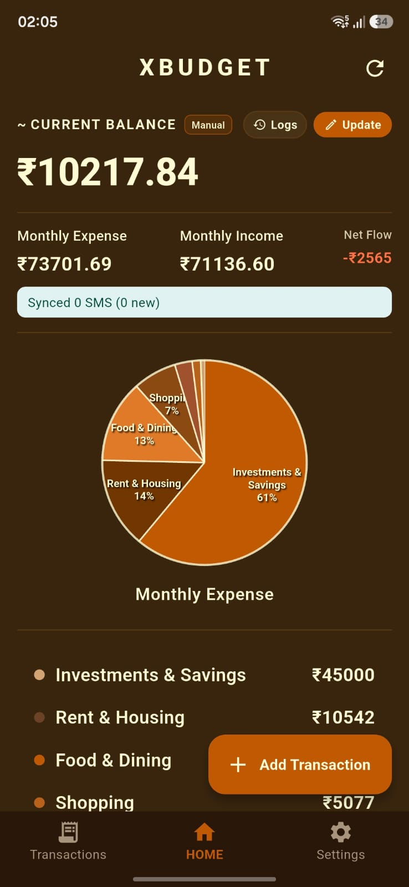
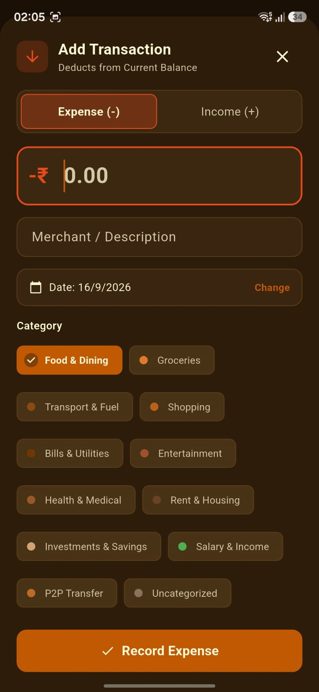

# xBudget


A privacy-focused, offline-first personal budgeting and expense tracking application built with Flutter. **xBudget** automatically parses transaction SMS messages directly on your device, tracks your real-time bank balance with audit logs, categorizes expenses, calculates custom monthly billing cycles, and provides optional Google Sheets sync with automated dashboards and charts without compromising user privacy.

---

## Description

- **What was your motivation?**  
  Managing personal finances is critical, but existing budgeting tools often create friction: they either require tedious manual logging for every small purchase or compromise user privacy by requiring bank credentials and transmitting financial statements to remote third-party servers.

- **Why did you build this project?**  
  We built **xBudget** to give users total control and immediate visibility over their spending and bank balances without sacrificing privacy. By leveraging on-device SMS parsing, users get the convenience of automated expense tracking with zero external cloud dependencies, with the option to back up directly to their personal Google Drive and Google Sheets.

- **What problem does it solve?**  
  - Eliminates manual transaction entry by automatically extracting amounts, merchants, categories, and account balances from incoming banking SMS notifications.
  - Keeps financial data 100% private and offline on the user's device by default.
  - Maintains a complete **Balance Audit Log & History** with manual adjustments, corrections, and automatic deductions/additions on transactions.
  - Tracks expenses and income across customizable **Monthly Billing / Budgeting Cycles** (e.g., matching salary dates) rather than rigid calendar months.
  - Generates month-wise tabs and automated analytics dashboards directly in the user's personal Google Sheets.
  - Automatically deduplicates recurring or re-synced notifications using cryptographic hashing.
  - Provides a single dashboard to monitor current available balances, monthly spending, and category breakdowns.

- **What did you learn?**  
  - Implementing strict **Clean Architecture** and the **BLoC Pattern** (`flutter_bloc`) in Flutter with pure domain entities, repositories, use cases, and presentation layers.
  - Designing an extensible **Strategy Pattern** for bank-specific SMS parsing (`BankParserStrategy`), making it trivial to add support for new banks.
  - Setting up dependency injection via `get_it` for clean separation of concerns.
  - Integrating Google Drive & Google Sheets API v4 using OAuth 2.0 (`google_sign_in`, `googleapis`) to generate formatted month-wise spreadsheets, summary formulas, and embedded charts.
  - Handling cycle date boundaries (`CycleDateUtil`) across irregular month lengths and leap years.
  - Deterministic deduplication using SHA-256 hashes of transaction metadata.
  - Writing comprehensive unit, BLoC, service, and widget tests in Flutter.

---

<p align="center">
  
  &nbsp;&nbsp;
  
</p>

## Table of Contents

- [Features](#features)
- [Architecture & Tech Stack](#architecture--tech-stack)
- [Installation](#installation)
- [Usage](#usage)
- [Tests](#tests)
- [How to Contribute](#how-to-contribute)
- [Credits](#credits)
- [License](#license)

---

## Features

- **Automated On-Device SMS Parsing**:
  - Modular parser architecture using the Strategy Pattern (`IciciParserStrategy` built-in, extensible to HDFC, SBI, Axis, etc.).
  - Fast-pass guard clauses to ignore OTPs, marketing SMS, and non-transactional messages.
  - Robust regex extraction for debit, credit, card spends, and UPI transactions.

- **Real-Time Balance Tracking & Audit History**:
  - Automatically captures latest available balance from transaction SMS.
  - Interactive **Note Balance** modal for manual adjustments and quick adjustment chips (`+₹500`, `+₹1,000`, `+₹5,000`, `-₹500`, `-₹1,000`).
  - Dedicated **Balance History** sheet tracking all balance log entries, sources (`SMS`, `Manual`, `Transaction`), and timestamps.
  - Support for editing, deleting, or adding retroactive balance corrections.
  - Automatic balance sync when adding income or expense transactions.

- **Customizable Monthly Budgeting Cycle**:
  - Set a custom billing cycle start day (1st to 31st) to align spending metrics with salary or credit card cycles.
  - Automatic calculation of cycle date ranges via `CycleDateUtil`, handling varying month lengths and leap years.
  - Real-time monthly spend and income recalculations based on active cycle boundaries.

- **Google Drive & Sheets Integration**:
  - Direct sync to the user's personal Google Drive using Google OAuth 2.0.
  - **Month-wise Tab Structure**: Organizes transactions into separate tabs named by month (`MMM yyyy`) according to the active billing cycle.
  - **Spreadsheet Analytics Dashboard**: Automatically generates summary cards, formulas, category breakdown tables, and an embedded native Google Sheets pie chart.

- **Intelligent Category Mapping & Visual Analytics**:
  - Multi-tier categorization engine covering Food, Groceries, Transport, Shopping, Bills, Entertainment, Health, Rent, Investment, Salary, and P2P Transfers.
  - Support for custom user-defined merchant category mapping rules with automatic updates upon category reassignment.
  - Interactive on-device expense breakdown pie chart with category filter chips and summary metrics.

- **Deterministic Deduplication**:
  - Generates SHA-256 hashes from transaction attributes (`amount`, `merchant`, `date`, `rawMessage`) to prevent duplicate records during incremental syncs.

- **100% Offline & Private by Default**:
  - No external backend or database required; local data resides securely on the device, with cloud sync strictly confined to user-owned Google Sheets.

- **Sample Data Ingestion for Testing**:
  - Built-in sample SMS generator allowing instant testing of all features across emulators, simulators, iOS, and Web without needing a physical SIM card.

---

## Architecture & Tech Stack

```
lib/
├── core/
│   ├── constants/       # App preferences & storage keys
│   ├── di/              # Dependency injection container (get_it)
│   ├── error/           # Failure models & error handling
│   ├── services/        # Google Sheets & SMS sync coordinators
│   ├── theme/           # AppColors & central ThemeData
│   ├── usecases/        # Base UseCase interface
│   └── utils/           # CycleDateUtil, SMS parser, categorizer & strategies
│       └── strategies/  # Bank-specific parsers (ICICI, etc.)
├── features/
│   ├── balance/         # Balance BLoC, log models, repository & history widgets
│   ├── home/            # Home screen, app bar, pie chart & cycle bottom sheet
│   ├── sync/            # SMS sync & Google Sheets sync BLoCs and use cases
│   └── transactions/    # Transaction BLoC, repository, sheets & category filters
└── main.dart            # App entry point & MultiBlocProvider setup
```

- **Framework**: [Flutter](https://flutter.dev/) (SDK `^3.10.0`)
- **Language**: [Dart](https://dart.dev/)
- **State Management**: `flutter_bloc` (BLoC Pattern)
- **Dependency Injection**: `get_it`
- **Cloud & Auth**: `google_sign_in`, `googleapis`
- **State & Storage**: `shared_preferences`
- **SMS Reading**: `flutter_sms_inbox`, `permission_handler`
- **Security & Hashing**: `crypto` (SHA-256)

---

## Installation

Follow these steps to set up the development environment and run **xBudget** locally:

### Prerequisites

- [Flutter SDK](https://docs.flutter.dev/get-started/install) (`v3.10.0` or later)
- [Dart SDK](https://dart.dev/get-dart)
- [Android Studio](https://developer.android.com/studio) or [VS Code](https://code.visualstudio.com/) with Flutter extensions
- Android device or Android Emulator (API 26+) for SMS features, or any simulator/web browser for sample data mode

### Step-by-Step Setup

1. **Clone the repository**:
   ```bash
   git clone https://github.com/your-username/xbudget.git
   cd xbudget
   ```

2. **Install dependencies**:
   ```bash
   flutter pub get
   ```

3. **Verify Flutter setup**:
   ```bash
   flutter doctor
   ```

4. **Run the application**:
   ```bash
   flutter run
   ```

> **Note for Android Users:** When prompted on first launch or during SMS sync, grant the **SMS Permission** to allow the app to read local bank transaction notifications.

---

## Usage

### 1. Synchronizing Transactions
- Tap the **Sync SMS** icon (`sync`) in the top app bar to read eligible bank messages from the past 60 days. Subsequent syncs will incrementally ingest only new messages.
- On non-Android platforms (or emulators without SMS), tap the **Flash** icon (`flash_on`) to load realistic sample banking SMS data.

### 2. Updating Current Balance & Viewing History
- Tap **Note Balance** or the balance card to view your available funds.
- Enter a specific balance or use the **Quick Adjustments** chips (`+₹500`, `+₹1,000`, etc.) to update your balance.
- Tap **History** on the balance card to view previous balance logs, edit entries, or record retroactive balance corrections.

### 3. Configuring Monthly Budgeting Cycle
- Tap the **Calendar / Cycle Settings** icon in the app bar.
- Choose your billing cycle start day (1st through 31st).
- Monthly spending, income, and Google Sheet tabs will dynamically recalculate for that cycle window.

### 4. Categorizing & Reviewing
- Tap any transaction card to open the **Transaction Details** bottom sheet.
- Inspect the raw SMS text, change the assigned category, or add custom notes.
- Filter transactions by category using the interactive category chips on the dashboard.
- Tap the **+** button to manually log an expense or income transaction.

### 5. Google Sheets Sync
- Tap **Connect Google Account** on the Google Sheets card.
- Tap **Sync to Google Sheets** to export your transactions.
- A dedicated spreadsheet is automatically created/updated in your Google Drive with month-wise tabs and an analytics dashboard with embedded pie charts.

---

## Tests

xBudget includes a comprehensive suite of 109 automated unit and widget tests covering parser strategies, BLoC state management, deduplication, categorization heuristics, monthly cycle calculations, Google Sheets service, and UI interactions.

### Running Tests

To run all automated tests:

```bash
flutter test
```

To run a specific test suite:

```bash
# Test SMS parsing and bank strategies
flutter test test/sms_parser_test.dart

# Test monthly cycle date utilities
flutter test test/core/cycle_date_util_test.dart

# Test Balance BLoC and use cases
flutter test test/features/balance/balance_bloc_test.dart
flutter test test/features/balance/get_balance_usecase_test.dart

# Test Transaction BLoC and categorization logic
flutter test test/features/transactions/transaction_bloc_test.dart
flutter test test/transaction_categorizer_test.dart

# Test Google Sheets service and synchronization
flutter test test/core/services/google_sheets_service_test.dart
flutter test test/features/sync/google_sheets_bloc_test.dart
flutter test test/features/sync/google_sheets_dashboard_test.dart

# Test UI widgets and modals
flutter test test/widget_test.dart
```

---

## How to Contribute

Contributions are welcome! Follow these steps to contribute:

1. **Fork the Repository**
2. **Create a Feature Branch**:
   ```bash
   git checkout -b feature/support-hdfc-bank
   ```
3. **Add a Bank Parser Strategy**:
   - Implement `BankParserStrategy` in `lib/core/utils/strategies/your_bank_parser_strategy.dart`.
   - Register it in `SmsParser` (`lib/core/utils/sms_parser.dart`).
   - Add corresponding test cases in `test/sms_parser_test.dart`.
4. **Run Tests & Linter**:
   ```bash
   flutter test
   flutter analyze
   ```
5. **Commit your changes**:
   ```bash
   git commit -m "Add HDFC bank SMS parser strategy"
   ```
6. **Push to Branch & Open a Pull Request**:
   ```bash
   git push origin feature/support-hdfc-bank
   ```

Please adhere to the [Contributor Covenant](https://www.contributor-covenant.org/) Code of Conduct.

---

## Credits

- **Flutter & Dart Teams** for the framework and developer tools.
- **Open-source Packages**:
  - [`flutter_sms_inbox`](https://pub.dev/packages/flutter_sms_inbox) - SMS inbox querying
  - [`permission_handler`](https://pub.dev/packages/permission_handler) - Runtime permissions
  - [`shared_preferences`](https://pub.dev/packages/shared_preferences) - Local persistence
  - [`crypto`](https://pub.dev/packages/crypto) - SHA-256 transaction hashing
  - [`flutter_bloc`](https://pub.dev/packages/flutter_bloc) - BLoC state management
  - [`get_it`](https://pub.dev/packages/get_it) - Dependency injection
  - [`google_sign_in`](https://pub.dev/packages/google_sign_in) - Google OAuth authentication
  - [`googleapis`](https://pub.dev/packages/googleapis) - Google Sheets and Drive API
  - [`cupertino_icons`](https://pub.dev/packages/cupertino_icons) - Iconography

---

## License

This project is licensed under the **MIT License**. See the [LICENSE](LICENSE) file for details.
